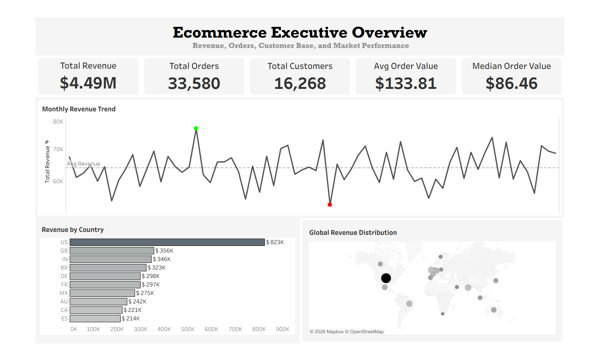
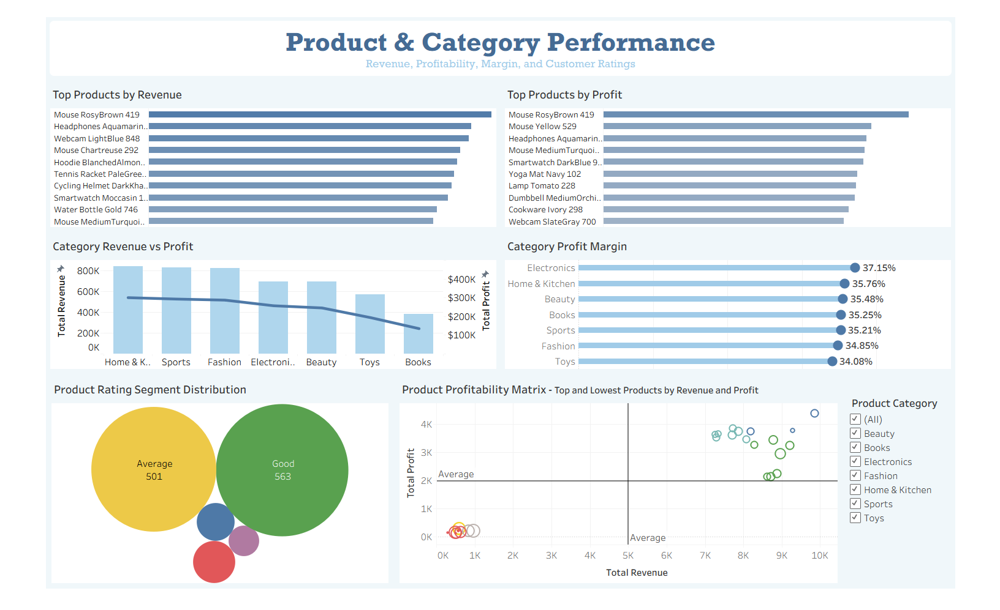
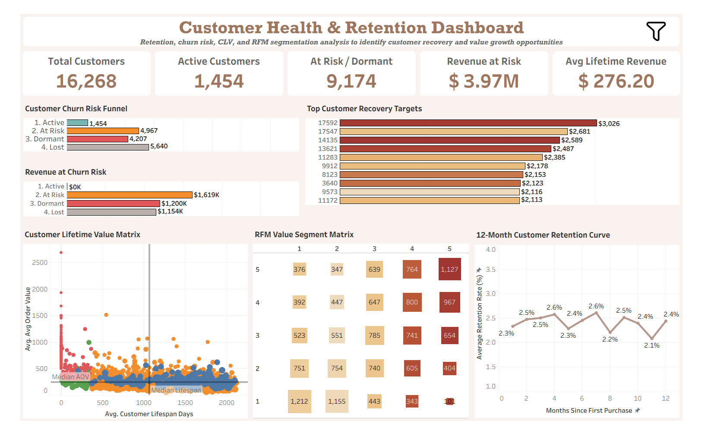
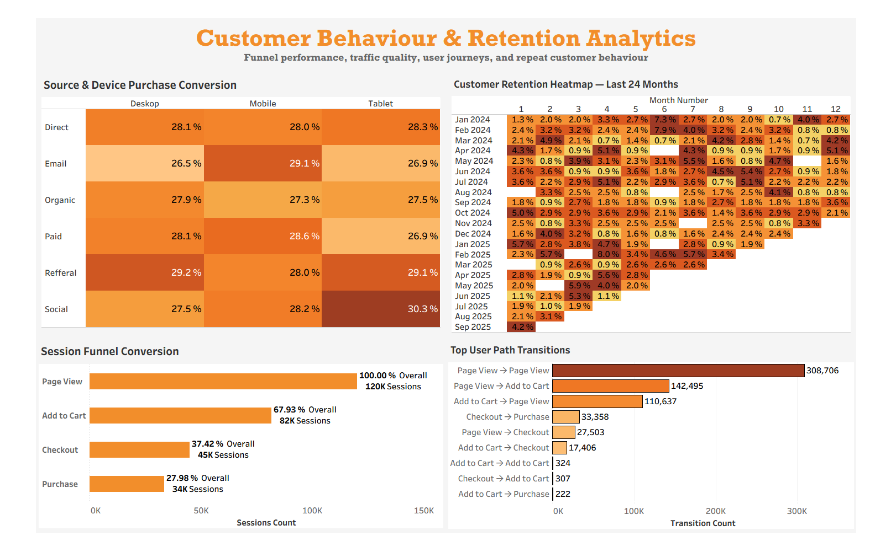

# 🛒 E-commerce Analytics Project using SQL, Data Modeling, and Tableau

## 🚀 Project Overview

This project is an end-to-end e-commerce business intelligence case study built using **PostgreSQL, SQL data modeling, and Tableau Public**.

The goal of this project was to transform raw e-commerce data into a structured analytical data model and build business dashboards that help answer key questions around:

* Revenue performance
* Product and category profitability
* Customer health and churn risk
* Customer lifetime value
* Funnel conversion
* User journey behaviour
* Cohort retention
* Source and device conversion
* Geographic market performance

The project follows a structured analytics workflow:

```text
Raw CSV Files
      ↓
PostgreSQL Bronze Layer
      ↓
Silver Cleaning & Standardization Layer
      ↓
Gold Fact, Dimension, and Analytical Views
      ↓
Tableau Dashboards
      ↓
Business Insights & Recommendations
```

---

## 📊 Interactive Tableau Dashboard

View the interactive Tableau dashboard here:

[View Tableau Public Dashboard](https://public.tableau.com/shared/92S6K28XY?:display_count=n&:origin=viz_share_link)

---

## 📖 Repository Structure

```text
ecommerce-sql-tableau-analytics/
│
├── assests/
│   ├── dashboard_1_executive_overview.png
│   ├── dashboard_2_product_performance.png
│   ├── dashboard_3_customer_retention.png
│   ├── dashboard_4_customer_behavior.png
│   ├── ecommerce_data_architecture.png
│   └── ecommerce_data_model.png
│
├── data/
│   ├── bronze/
│   ├── silver/
│   └── gold/
│
├── docs/
│   ├── business_insights.md
│   ├── dashboard_guide.md
│   ├── sql_analysis_summary.md
│   └── data_dictionary.md
│
├── sql/
│   └── SQL scripts for Bronze, Silver, Gold, and analytics views
│
├── tableau/
│   ├── ecommerce_analytics_dashboard.twbx
│   └── tableau_public_link.txt
│
├── README.md
└── LICENSE
```

---

## 💼 Business Problem

E-commerce businesses face multiple performance challenges across revenue, products, customers, and user behaviour.

This project focuses on solving the following business questions:

1. How is the business performing overall?
2. Which countries, products, and categories generate the most revenue?
3. Which products and categories are most profitable?
4. Are high-revenue products also high-profit products?
5. Which customers are active, at risk, dormant, or lost?
6. How much revenue is at risk due to churn?
7. Which customers should be prioritized for recovery campaigns?
8. Where do users drop off in the purchase funnel?
9. Which source and device combinations convert best?
10. What are the most common user journey paths?
11. How does customer retention behave after acquisition?

---

## 📋 Dataset Overview

The project uses multiple e-commerce datasets covering transactional, product, customer, session, event, and review data.

### Raw Source Files

| Dataset           | Description                                                                                                       |
| ----------------- | ----------------------------------------------------------------------------------------------------------------- |
| `customers.csv`   | Customer profile data including customer ID, country, signup date, age, and marketing preference                  |
| `orders.csv`      | Order-level transaction data including order value, payment method, discount, device, traffic source, and country |
| `order_items.csv` | Product-level order line data including quantity, unit price, and line total                                      |
| `products.csv`    | Product catalog data including product name, category, price, cost, and margin                                    |
| `sessions.csv`    | Session-level user activity data including session ID, customer ID, device, source, and country                   |
| `events.csv`      | Event-level clickstream data including page view, add-to-cart, checkout, and purchase events                      |
| `reviews.csv`     | Product review data including review ID, product ID, rating, review text, and review timestamp                    |

---

## 🏗️ Data Architecture

The project follows a **Medallion Architecture** with Bronze, Silver, and Gold layers.


### 🥉 Bronze Layer

The Bronze layer stores raw CSV files imported into PostgreSQL.

Purpose:

* Preserve original raw data
* Maintain source-level structure
* Create a reliable starting point for cleaning and transformation

Examples:

```text
bronze.customers
bronze.orders
bronze.order_items
bronze.products
bronze.sessions
bronze.events
bronze.reviews
```

---

### ⚙️ Silver Layer

The Silver layer contains cleaned and standardized SQL views created from the Bronze layer.

Cleaning and standardization included:

* Renaming unclear columns
* Correcting data types
* Standardizing country codes
* Trimming unwanted spaces
* Removing unwanted symbols where needed
* Converting timestamp fields into date-friendly columns
* Converting numeric columns such as product ID, quantity, and cart size into proper integer formats
* Preparing clean views for downstream analysis

The Silver layer was used to create consistent, analysis-ready tables before building the Gold layer.

---

### 🏆 Gold Layer

The Gold layer contains business-ready fact tables, dimension tables, and analytical views.

The Gold layer was designed for reporting and Tableau dashboarding.

Gold layer outputs include:

* Fact views
* Dimension views
* KPI views
* Product performance views
* Customer health views
* Funnel views
* Cohort retention views
* Tableau-ready CSV exports

---

## 📝 Data Model

The Gold layer follows a star-schema-style analytical model.


### Dimension Views

| View                 | Purpose                                                                |
| -------------------- | ---------------------------------------------------------------------- |
| `gold.dim_customers` | Customer descriptive attributes for segmentation and customer analysis |
| `gold.dim_products`  | Product descriptive attributes for product and category analysis       |

### Fact Views

| View                    | Purpose                                 |
| ----------------------- | --------------------------------------- |
| `gold.fact_orders`      | Order-level transaction facts           |
| `gold.fact_order_items` | Product-level order line facts          |
| `gold.fact_sessions`    | Session-level customer behaviour facts  |
| `gold.fact_events`      | Event-level clickstream behaviour facts |
| `gold.fact_reviews`     | Product review and rating facts         |

### Why Fact and Dimension Modeling Was Used

Fact and dimension modeling was used to separate:

* **Business events and metrics** such as orders, revenue, quantity, sessions, events, and reviews
* **Descriptive context** such as customers, products, categories, countries, devices, and traffic sources

This structure improves:

* Query readability
* Reusability
* Reporting consistency
* Dashboard performance
* Business interpretation

---

## ▶️ SQL Workflow

The SQL workflow included four major stages:

```text
1. Raw data ingestion
2. Data cleaning and standardization
3. Data modeling
4. Business analysis and reporting views
```

### 1. Raw Data Ingestion

Raw CSV files were imported into PostgreSQL Bronze tables.

The goal was to keep the raw data unchanged before applying any business rules.

---

### 2. Cleaning and Standardization

The Silver layer standardized the raw data.

Examples of cleaning work:

* Standardized country abbreviations
* Fixed integer columns in event data
* Removed unwanted symbols from numeric columns
* Converted text-based dates into usable date formats
* Preserved long review text for customer feedback analysis
* Standardized column names to make them readable and business-friendly

---

### 3. Data Modeling

The Gold layer converted cleaned Silver views into fact and dimension views.

This created a structured analytical model for business reporting.

Important modeling decisions:

* Customers and products were modeled as dimensions
* Orders, order items, sessions, events, and reviews were modeled as fact views
* Product price, cost, revenue, profit, quantity, and rating were treated as measurable business fields
* Customer behaviour was modeled through sessions and events
* Order-level and event-level data were kept separate to avoid grain confusion

---

### 4. Analytical Views

SQL analytical views were created for each business use case.

Examples:

| Analytical Output          | Business Purpose                             |
| -------------------------- | -------------------------------------------- |
| `sales_kpis`               | Executive KPI reporting                      |
| `monthly_sales_trend`      | Revenue and order trend analysis             |
| `country_performance`      | Market-level performance analysis            |
| `product_performance`      | Product revenue, profit, and margin analysis |
| `category_performance`     | Category-level profitability                 |
| `review_analysis`          | Product rating and review analysis           |
| `funnel_analysis`          | Session funnel conversion                    |
| `source_device_conversion` | Traffic source and device conversion         |
| `user_paths`               | User journey path analysis                   |
| `cohort_retention`         | Customer retention over time                 |
| `rfm_analysis`             | Customer segmentation                        |
| `churn_analysis`           | Churn risk and revenue-at-risk analysis      |
| `customer_lifetime_value`  | Customer value and lifespan analysis         |

---

## 🗂️ SQL Concepts Used

This project demonstrates practical SQL concepts used in real business analytics work.

| SQL Concept      | How It Was Used                                                                    |
| ---------------- | ---------------------------------------------------------------------------------- |
| Joins            | Connected orders, customers, products, sessions, events, and reviews               |
| CTEs             | Built multi-step analysis in readable query blocks                                 |
| Aggregations     | Created revenue, profit, order, quantity, customer, and conversion metrics         |
| CASE Statements  | Created customer status, rating segments, churn groups, and business categories    |
| Date Functions   | Created monthly trends, cohort months, customer lifespan, and recency calculations |
| Window Functions | Used for ranking, previous-period comparison, pathing, and segmentation            |
| `LAG()`          | Compared current month with previous month                                         |
| `LEAD()`         | Analyzed next event in user pathing                                                |
| `NTILE()`        | Created RFM score buckets                                                          |
| Ranking Logic    | Ranked products, countries, customers, and categories                              |
| Cohort Logic     | Measured customer retention by acquisition month                                   |
| Funnel Logic     | Measured conversion through page view, add-to-cart, checkout, and purchase         |
| Churn Logic      | Classified customers into active, at-risk, dormant, and lost groups                |
| CLV Logic        | Calculated lifetime revenue, order count, and lifespan                             |
| Views            | Created reusable reporting layers for Tableau                                      |

---

## Tableau Dashboards

The Tableau workbook contains four dashboards.

---

## 📊 Dashboard 1: Executive Overview



### Purpose

This dashboard provides a high-level summary of business performance.

### Key Metrics

* Total revenue
* Total orders
* Total customers
* Average order value
* Median order value
* Revenue per customer
* Monthly revenue trend
* Revenue by country
* Global revenue distribution

### Business Problems Solved

This dashboard helps leadership understand:

* Overall business scale
* Revenue trend movement
* Geographic revenue contribution
* Difference between average and median order value
* Whether revenue is growing, stable, or fluctuating

### Key Insights

* Total revenue reached approximately **$4.49M**
* Total orders reached **33,580**
* Total customers reached **16,268**
* Average order value was **$133.81**
* Median order value was **$86.46**
* The gap between average and median order value suggests that a smaller group of high-value orders is pulling the average upward
* The United States was the largest revenue-contributing country
* Revenue appears relatively stable but not strongly compounding

---

## 📊 Dashboard 2: Product & Category Performance



### Purpose

This dashboard analyzes product and category performance using revenue, profit, profit margin, and customer ratings.

### Key Visuals

* Top products by revenue
* Top products by profit
* Product profitability matrix
* Category revenue vs profit
* Category profit margin ranking
* Product rating distribution

### Business Problems Solved

This dashboard helps answer:

* Which products drive the most revenue?
* Which products drive the most profit?
* Are high-revenue products also profitable?
* Which categories have the highest margins?
* Which products are low-contribution products?
* Are product ratings aligned with business performance?

### Key Insights

* Top products by revenue and profit show strong overlap
* Electronics showed the highest category profit margin
* Category profit margins are relatively healthy and balanced
* Product profitability analysis helps separate strong products from low-contribution products
* Most products fall under Good or Average rating segments
* Product ratings and review volume can be used as conversion improvement levers

### Business Interpretation

The business does not appear to have a major category margin problem. Category economics are generally healthy.

The bigger opportunity is to:

* Scale high-revenue and high-profit products
* Promote high-margin categories
* Improve review density for top products
* Reassess low-contribution products
* Use product profitability to guide inventory, pricing, and promotion decisions

---

## 📊 Dashboard 3: Customer Health & Retention



### Purpose

This dashboard identifies customer health, churn risk, customer lifetime value, revenue at risk, and recovery opportunities.

### Key Visuals

* Customer health KPIs
* Customer churn risk funnel
* Revenue at churn risk
* Top customer recovery targets
* Customer lifetime value matrix
* RFM value segment matrix
* 12-month retention curve

### Business Problems Solved

This dashboard helps answer:

* How many customers are active, at risk, dormant, or lost?
* How much revenue is at risk?
* Which customers should be prioritized for recovery?
* Which customer groups are high value?
* How does retention behave after first purchase?
* Which customers should receive reactivation campaigns?

### Key Insights

* Retention is the biggest strategic weakness
* Churned customer rate is very high
* Active customer rate is very low
* Revenue at risk is meaningful
* Customer lifetime revenue is concentrated but not only dependent on a tiny group
* The middle customer segment has room for value expansion

### Business Interpretation

The business is not only facing an acquisition challenge. It has a customer compounding problem.

Customers are converting, but many are not becoming durable repeat buyers.

This creates risk because:

* Revenue depends on continuously replacing inactive customers
* Customer acquisition efficiency becomes fragile
* CLV remains limited
* Growth becomes harder to compound over time

---

## 📊 Dashboard 4: Customer Behaviour & Retention Analytics



### Purpose

This dashboard analyzes customer journey behaviour, source-device conversion, funnel performance, user path transitions, and recent cohort retention.

### Key Visuals

* Source and device purchase conversion heatmap
* Session funnel conversion
* Top user path transitions
* Customer retention heatmap for the last 24 months

### Business Problems Solved

This dashboard helps answer:

* Which source-device combinations convert best?
* Where do users drop off in the funnel?
* What are the most common user journey transitions?
* How does retention change across recent cohorts?
* Which parts of the user journey need improvement?

### Key Insights

* Funnel conversion drops from **120K page view sessions** to **34K purchase sessions**
* Add-to-cart behaviour is strong, but checkout progression shows major drop-off
* The biggest funnel loss occurs between add-to-cart and checkout
* Social + Tablet showed the strongest source-device purchase conversion rate
* Page View → Add to Cart is one of the most important forward user path transitions
* Retention after acquisition remains weak across later months

### Business Interpretation

The business should focus on reducing cart-to-checkout friction.

Potential issues may include:

* Hidden shipping costs
* Weak cart UX
* Low checkout urgency
* Trust concerns
* Promo-code hunting
* Mobile checkout friction
* Product comparison behaviour

---

## 💡 Key Business Insights

### 1. Revenue Is Stable, but Not Strongly Growing

The business generates solid revenue, but the yearly revenue pattern appears more like a plateau than a high-growth curve.

This suggests the business can acquire enough demand to maintain revenue, but it is not retaining enough customers to create strong compounding growth.

---

### 2. Retention Is the Biggest Strategic Weakness

Customer retention is the most important issue found in the analysis.

Low post-acquisition retention indicates that customers are not consistently returning after their first purchase period.

This affects:

* CLV
* Growth durability
* Acquisition efficiency
* Revenue predictability

---

### 3. Customer Reactivation Is a Major Opportunity

A large portion of revenue is tied to customers classified as at risk, dormant, or lost.

This creates a clear opportunity for:

* Win-back campaigns
* Second-purchase campaigns
* Personalized lifecycle marketing
* Loyalty offers
* Category-based reactivation

---

### 4. Funnel Leakage Is Costly

The largest funnel drop occurs between Add to Cart and Checkout.

This indicates that users show product intent but fail to move into checkout.

Improving this stage could create meaningful order lift without requiring more traffic.

---

### 5. Product Economics Are Healthy

Category revenue and profit are relatively balanced.

The business does not appear to have a major category profitability problem.

This means the stronger opportunity is not fixing category economics, but improving:

* Retention
* Reactivation
* Customer value expansion
* Funnel efficiency

---

### 6. High-Value Customers Matter, but the Middle Segment Has Upside

The top 10% of customers contribute a meaningful share of revenue.

However, the business is not completely dependent on a tiny group of customers.

This means there is opportunity to grow revenue by moving middle-value customers into higher-value behaviour.

---

## ⚡ E-commerce Challenges Identified

This project identified several common e-commerce challenges.

### Customer Retention Challenge

Many customers do not continue purchasing after the initial acquisition period.

### Churn and Reactivation Challenge

A large number of customers are classified as inactive or churned, creating revenue risk.

### Funnel Drop-off Challenge

Users move from page view to add-to-cart at a healthy rate, but many do not progress from cart to checkout.

### Product Discovery Challenge

Repeated page-view paths suggest customers may be browsing heavily before deciding.

### Customer Value Expansion Challenge

The business has a strong customer base, but many customers are not being expanded into higher lifetime value segments.

### Review and Trust Challenge

Some products may need stronger review density to improve conversion confidence.

### Market Optimization Challenge

Country-level performance varies, suggesting opportunities for localized campaigns, payment methods, and shipping communication.

---

## 💬 Recommendations

### 1. Improve Cart-to-Checkout Conversion

Recommended actions:

* Show total cost earlier
* Improve delivery and returns messaging
* Reduce cart distractions
* Add trust signals
* Improve mobile checkout
* Use abandoned cart reminders

---

### 2. Build Customer Reactivation Campaigns

Segment customers into:

* High-value lapsed customers
* Recent one-time buyers
* Dormant repeat buyers
* Long-lapsed low-value customers

Recommended actions:

* Personalized win-back offers
* Second-purchase nudges
* Category-based product recommendations
* Loyalty campaigns
* Time-sensitive incentives

---

### 3. Scale High-Profit Products

Use the product profitability matrix to identify products that have both strong revenue and strong profit.

Recommended actions:

* Increase product visibility
* Improve inventory planning
* Use remarketing campaigns
* Create bundles around high-performing products

---

### 4. Improve Product Review Strategy

Recommended actions:

* Prioritize review generation for top products
* Request reviews after delivery
* Highlight review count and rating together
* Use reviews in product pages and remarketing flows

---

### 5. Optimize Source and Device Strategy

Recommended actions:

* Invest more in high-converting source-device combinations
* Improve mobile and tablet checkout experience
* Connect traffic source performance with CLV
* Avoid optimizing only for session volume

---

### 6. Use Country-Level Strategy

Recommended actions:

* Localize campaigns for high-revenue countries
* Improve local payment and trust messaging
* Review shipping expectations by market
* Identify countries with strong revenue per customer

---

## 90-Day Business Action Plan

### First 30 Days: Stop the Biggest Leaks

* Launch win-back campaigns for high-value lapsed customers
* Build second-purchase campaigns for one-time buyers
* Improve abandoned cart recovery
* Start review request campaigns for top products

### Days 30–60: Segment and Personalize

Create customer segments:

* High-CLV active customers
* High-CLV at-risk customers
* Recent one-time buyers
* Repeat low-value customers
* Repeat high-value customers

Use these segments to personalize:

* Offers
* Timing
* Product recommendations
* Channel strategy

### Days 60–90: Optimize Economics

Focus on:

* Source/device quality
* Category hero products
* SKU pruning
* Country-level conversion improvements
* Repeat purchase uplift tracking

---

## 🛠️ Tools Used

| Tool           | Purpose                                                                                          |
| -------------- | ------------------------------------------------------------------------------------------------ |
| PostgreSQL     | Database, SQL modeling, and analysis                                                             |
| SQL            | Data cleaning, transformation, joins, CTEs, views, cohort logic, churn, RFM, and funnel analysis |
| Tableau Public | Dashboard development and interactive reporting                                                  |
| GitHub         | Project documentation and portfolio hosting                                                      |
| Draw.io        | Data architecture and data model diagrams                                                        |
| CSV            | Data storage and Tableau export format                                                           |

---

## 📜 Project Summary

This project demonstrates an end-to-end analytics workflow from raw data to business reporting.

The project started with raw e-commerce CSV files and transformed them into structured PostgreSQL layers using a Bronze, Silver, and Gold architecture.

The Silver layer standardized and cleaned the data, while the Gold layer created fact, dimension, and analytical views for business reporting.

SQL was used to build reusable analytical outputs using joins, CTEs, aggregations, window functions, cohort analysis, funnel logic, RFM segmentation, churn classification, and customer lifetime value calculations.

Tableau dashboards were then built to convert those analytical outputs into clear business insights.

The final business conclusion is:

> This is a solid e-commerce business with healthy product economics and decent conversion performance, but weak retention is preventing durable growth.

The strongest growth lever is not simply more traffic. The strongest opportunity is better reactivation, stronger second-purchase conversion, improved lifecycle marketing, and smarter monetization of customers already acquired.

---

## 📄 License

This project is licensed under the MIT License.

---

## 👤 Author

Balaji Reddy  
GitHub: https://github.com/balaji-167
