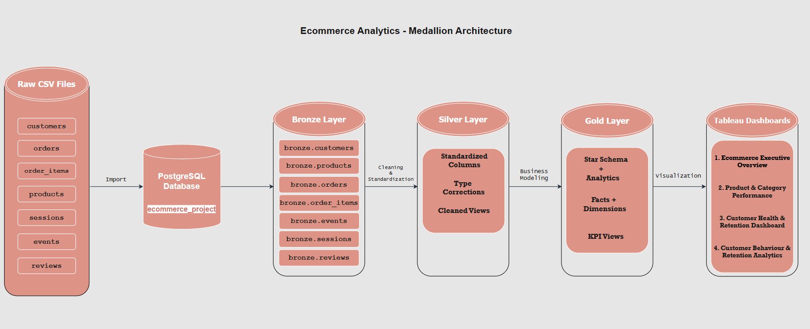
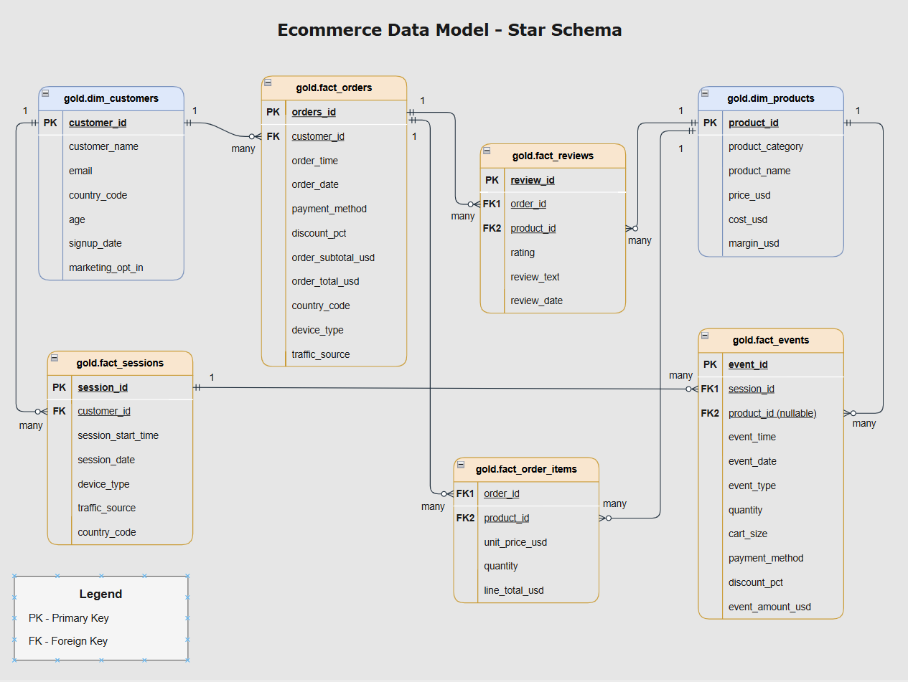

# 🛒 E-commerce Analytics Project | SQL + Tableau

## 📌 Project Overview

This is an end-to-end **E-commerce Business Intelligence project** built using **PostgreSQL, SQL data modeling, and Tableau Public**.

The project transforms raw e-commerce data into structured analytical layers and interactive dashboards to analyze:

* Revenue performance
* Product and category profitability
* Customer health and churn risk
* Funnel conversion
* User behaviour
* Retention patterns
* Geographic market performance

🔗 **Interactive Tableau Dashboard:**
[View Tableau Public Dashboard](https://public.tableau.com/shared/92S6K28XY?:display_count=n&:origin=viz_share_link)

---

## 🧰 Tools & Technologies

| Tool           | Purpose                                                        |
| -------------- | -------------------------------------------------------------- |
| PostgreSQL     | Database, data modeling, and SQL analysis                      |
| SQL            | Cleaning, transformation, joins, CTEs, views, window functions |
| Tableau Public | Dashboarding and interactive reporting                         |
| Draw.io        | Data architecture and data model diagrams                      |
| GitHub         | Project documentation and portfolio hosting                    |
| CSV            | Raw and processed data storage                                 |

---

## 🏗️ Project Workflow

```text
Raw CSV Files
      ↓
Bronze Layer
      ↓
Silver Layer
      ↓
Gold Layer
      ↓
Tableau Dashboards
      ↓
Business Insights
```

---

## 🗂️ Repository Structure

```text
ecommerce-sql-tableau-analytics/
│
├── assets/
│   ├── dashboard_1_executive_overview.png
│   ├── dashboard_2_product_performance.png
│   ├── dashboard_3_customer_retention.png
│   ├── dashboard_4_customer_behavior.png
│   ├── ecommerce_data_architecture.png
│   └── ecommerce_data_model.png
│
├── data/
│   ├── bronze/
│   ├── silver/
│   └── gold/
│
├── docs/
│   ├── business_insights.md
│   ├── dashboard_guide.md
│   ├── sql_analysis_summary.md
│   └── data_dictionary.md
│
├── sql/
│   └── SQL scripts
│
├── tableau/
│   ├── ecommerce_analytics_dashboard.twbx
│   └── tableau_public_link.txt
│
├── README.md
└── LICENSE
```

---

## 🏛️ Data Architecture

The project follows a **Medallion Architecture** approach:

| Layer           | Purpose                                             |
| --------------- | --------------------------------------------------- |
| 🥉 Bronze Layer | Raw CSV files imported into PostgreSQL              |
| 🥈 Silver Layer | Cleaned and standardized SQL views                  |
| 🥇 Gold Layer   | Fact, dimension, and analytical views for reporting |



---

## 🧩 Data Model

The Gold layer follows a star-schema-style analytical model.

### Dimension Views

| View                 | Description         |
| -------------------- | ------------------- |
| `gold.dim_customers` | Customer attributes |
| `gold.dim_products`  | Product attributes  |

### Fact Views

| View                    | Description                       |
| ----------------------- | --------------------------------- |
| `gold.fact_orders`      | Order-level transactions          |
| `gold.fact_order_items` | Product-level order lines         |
| `gold.fact_sessions`    | Session-level user activity       |
| `gold.fact_events`      | Event-level clickstream behaviour |
| `gold.fact_reviews`     | Product review facts              |



---

## 🧹 Data Cleaning & Standardization

The Silver layer was created to clean and standardize raw data before analysis.

Key cleaning steps included:

* Standardized column names
* Corrected data types
* Converted date/time fields
* Cleaned numeric fields
* Standardized country codes
* Converted product ID, quantity, and cart size into proper integer formats
* Preserved review text for customer feedback analysis
* Validated primary and foreign key relationships

---

## 🧠 SQL Analysis

SQL was used to create reusable analytical views for business reporting.

### SQL Concepts Used

* Joins
* CTEs
* Aggregations
* CASE statements
* Window functions
* Ranking logic
* Date functions
* Funnel analysis
* Cohort retention
* RFM segmentation
* Churn classification
* Customer lifetime value analysis
* Star schema modeling
* SQL views

---

## 📊 Tableau Dashboards

The project contains **4 interactive Tableau dashboards**.

---

## 1️⃣ Executive Overview Dashboard

### Purpose

Provides a high-level view of business performance.

### Key Metrics

* Total revenue
* Total orders
* Total customers
* Average order value
* Median order value
* Monthly revenue trend
* Revenue by country
* Global revenue distribution


### Key Insights

* Total revenue reached approximately **$4.49M**
* Total orders reached **33,580**
* Total customers reached **16,268**
* Average order value was **$133.81**
* Median order value was **$86.46**
* The gap between average and median order value suggests higher-value orders are lifting the average
* The United States was the top revenue-contributing country

---

## 2️⃣ Product & Category Performance Dashboard

### Purpose

Analyzes product and category performance using revenue, profit, margin, and ratings.

### Key Visuals

* Top products by revenue
* Top products by profit
* Product profitability matrix
* Category revenue vs profit
* Category profit margin ranking
* Product rating distribution


### Key Insights

* Top revenue products also contribute strongly to profit
* Electronics showed the highest category profit margin
* Category margins are healthy and balanced
* Most products fall under Good or Average rating segments
* Product profitability analysis helps identify high-performing and low-contribution products

---

## 3️⃣ Customer Health & Retention Dashboard

### Purpose

Identifies customer churn risk, revenue at risk, customer lifetime value, and recovery opportunities.

### Key Visuals

* Customer health KPIs
* Customer churn risk funnel
* Revenue at churn risk
* Top customer recovery targets
* Customer lifetime value matrix
* RFM value segment matrix
* Retention curve


### Key Insights

* Retention is the biggest strategic weakness
* Churned customer rate is very high
* Active customer rate is very low
* Revenue at risk is meaningful
* Customer recovery campaigns can unlock business value

---

## 4️⃣ Customer Behaviour & Retention Analytics Dashboard

### Purpose

Analyzes user behaviour, funnel conversion, source-device conversion, user path transitions, and cohort retention.

### Key Visuals

* Source and device purchase conversion heatmap
* Session funnel conversion
* Top user path transitions
* Customer retention heatmap


### Key Insights

* Funnel conversion drops from **120K page views** to **34K purchases**
* The largest funnel drop occurs between **Add to Cart** and **Checkout**
* Social + Tablet showed the strongest source-device conversion rate
* Page View → Add to Cart is a key user path transition
* Retention after acquisition remains weak across later months

---

## 🚨 E-commerce Challenges Identified

This project identified several business challenges:

| Challenge                | Explanation                                         |
| ------------------------ | --------------------------------------------------- |
| Customer retention       | Customers do not consistently return after purchase |
| Churn risk               | Many customers are inactive, dormant, or lost       |
| Funnel drop-off          | Users drop between add-to-cart and checkout         |
| Revenue plateau          | Revenue is stable but not strongly growing          |
| Customer value expansion | Middle-value customers are not being moved upward   |
| Product trust            | Review volume can be improved for top products      |
| Geographic optimization  | Country-level performance varies across markets     |

---

## 💡 Business Recommendations

### 1. Improve Cart-to-Checkout Conversion

* Show total cost earlier
* Improve delivery and return messaging
* Reduce cart distractions
* Add trust signals
* Improve mobile checkout
* Use abandoned cart reminders

### 2. Build Customer Reactivation Campaigns

Target:

* High-value lapsed customers
* Recent one-time buyers
* Dormant repeat buyers
* Long-lapsed low-value customers

### 3. Scale High-Profit Products

* Increase visibility for high-profit products
* Improve inventory planning
* Promote high-performing categories
* Build bundles around strong products

### 4. Improve Review Strategy

* Request reviews after delivery
* Prioritize top-revenue products
* Highlight review count and average rating
* Use review content in product pages and remarketing

### 5. Optimize Source and Device Strategy

* Invest in high-converting source-device combinations
* Improve mobile and tablet checkout
* Connect marketing source with CLV
* Avoid optimizing only for traffic volume

---

## 📈 Final Business Conclusion

This is a solid e-commerce business with healthy product economics and decent funnel conversion.

However, the biggest strategic weakness is **customer retention**.

The strongest growth opportunity is not only acquiring more traffic. The business should focus on:

* Better reactivation
* Stronger second-purchase conversion
* Improved lifecycle marketing
* Smarter monetization of already acquired customers

---

## 📚 Supporting Documentation

| Document                                             | Description                                    |
| ---------------------------------------------------- | ---------------------------------------------- |
| [Business Insights](docs/business_insights.md)       | Detailed business findings and recommendations |
| [Dashboard Guide](docs/dashboard_guide.md)           | Explanation of all Tableau dashboards          |
| [SQL Analysis Summary](docs/sql_analysis_summary.md) | SQL workflow, concepts, and analytical views   |

---

## ▶️ How to Reproduce This Project

1. Import raw CSV files from the Bronze layer into PostgreSQL.
2. Run SQL scripts from the `sql/` folder.
3. Create Silver layer cleaned views.
4. Create Gold layer fact, dimension, and analytical views.
5. Export Gold layer outputs as CSV files.
6. Connect the Gold layer CSVs to Tableau.
7. Build dashboards using the Tableau workbook.
8. View the final interactive dashboard on Tableau Public.

---

## ✅ Project Status

Completed.

This project demonstrates a complete analytics workflow from raw data to SQL modeling, Tableau dashboarding, and business decision-making.

---

## 📄 License

This project is licensed under the MIT License.

---

## 👤 Author

Balaji Reddy  
GitHub: https://github.com/balaji-167
